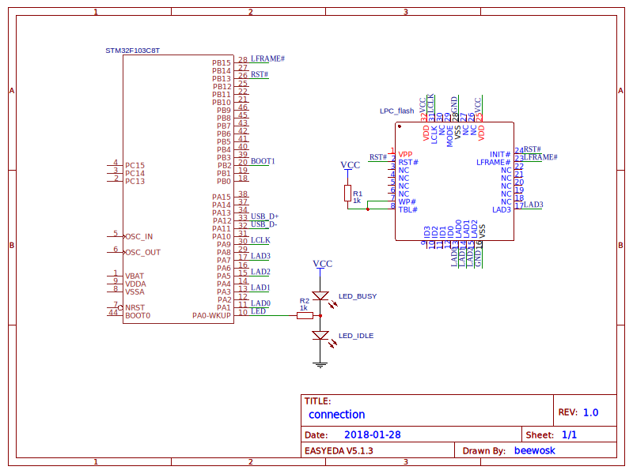

# stm32-vserprog-lpc:
## flashrom serprog LPC programmer based on STM32 MCU & USB CDC protocol.
**This project based on [`stm32-vserprog`](https://github.com/dword1511/stm32-vserprog) and [`frser-teensyflash`](https://github.com/urjaman/frser-teensyflash) projects.**

* * *
### Features
* Based on open-source Cortex-M3 library [`libopencm3`](https://github.com/libopencm3/libopencm3).
* `flashrom` serprog protocol (see [`flashrom wiki`](https://www.flashrom.org/Serprog)).

* * *
### Installation
1. Install `stm32flash` and the `gcc-arm-none-eabi` toolchain. 

On Debian, simply do the following:
```bash
   $ apt-get install stm32flash gcc-arm-none-eabi
   ```

3. Clone and compile.

  Simply type (change the board name accordingly, for details see the header of the `Makefile` or just type `make`):

   ```bash
   git clone https://github.com/wosk/stm32-vserprog-lpc.git
   make BOARD=stm32f103-ugly
   ```
4. Program.

Program via USB-UART adapter need pulled up _BOOT0_ pin and pulled low _BOOT1_ pin (See section 3.4 [`reference manual STM32F1xxxx `](http://www.st.com/resource/en/reference_manual/CD00171190.pdf)).

   ```bash
   make BOARD=stm32f103-ugly flash
   ```
Do not forget to pull low _BOOT0_ pin after flashing for run firmware.

* * *
### Usage
#### Hardware side
For connecting PLCC LPC flash need:

  * PLCC 32 pin DIP socket (DS1032-32D)
  * 9 necessary wires (for Vss, Vdd, LFRAME#, LCLK, RST#, LAD[3:0])
  * 3 possibly necessary wires (for connect RST# with INIT#, Vdd (pin 25) with Vdd (pin 32), Vss (pin 16) with Vss (pin 28))
  * 1 resistor about 150...1000 Ohm (for pull up WP# and TBL# for disable write protection)

The final scheme:



#### Software side
 The following assumes Linux platform, and that the programmer appears as `/dev/ttyACM0`.

1. To read a flash chip:
   ```bash
   flashrom -p serprog:dev=/dev/ttyACM0 -r file-to-save.bin -c chip-name
   ```

2. To write a flash chip:
   ```bash
   flashrom -p serprog:dev=/dev/ttyACM0 -w file-to-load.bin -c chip-name
   ```
  * Flash chips are checked and blocks that are not empty are automatically erased.
  * Images are verified after writing automatically.
  * The whole process can take a few minutes.
 
3. To erase a flash chip:
   ```bash
   flashrom -p serprog:dev=/dev/ttyACM0 -E -c chip-name
   ```

* * *
### Tested
* Winbond W39V040BPZ 512 kB (read 19 sec, erase 26 sec, write 6 min)
* SST 49LF040B 512 kB (read 18 sec, erase 21 sec, write 6 min)

### Known bugs
* Probing chip (without argument "-c chipname") not work properly.

### Problems?
1. If you encountered something like "`Error: Cannot open serial port: Device or resource busy`", please try to stop or remove `ModemManager`.
1. Check your wirings and `flashrom` version. Do not forget to power the flash chip itself if operating on a breadboard or prototype board.
1. If you are sure it is caused by bugs in the programmer's firmware,
   please [open a new ticket](https://github.com/wosk/stm32-vserprog-lpc/issues) and provide details, e.g. the board you are using and `flashrom -VVV`'s output. I appreciate your feedback.
